
<h1 align="center">新枫之谷游戏攻略与信息平台的设计与实现</h1>

## 简介
新枫之谷游戏攻略与信息平台：角色分为管理员、用户；提供游戏攻略管理、用户管理、论坛互动、公告发布、后台管理等功能，界面简洁，便于操作和信息交流。    --计算机毕业设计源码；毕设源码；java毕业设计源码

## 联系方式

<h3 align="center">获取完整代码与数据库文件 + 微信：deepguan QQ: 86050149 QQ群: 783742310</h3>

<h3 align="center">可帮忙远程部署 包运行成功！提供远程部署、修改代码、设计文档指导、代码讲解等服务！</h3>

## 功能介绍（完整见运行截图）
管理员：基本功能包括登录、注册和退出。主页有主导航栏，支持轮播图管理，并可进行商品推荐及扶贫政策展示，还能管理游戏攻略和公告。提供用户管理、游戏攻略管理、基础数据管理、论坛管理和公告管理的功能。具备用户信息的编辑与修改，上传与管理资源，如图片与公告等。支持帖子信息管理，能批量操作或查询删除。

用户：基本功能涵盖登录、注册和退出。网站首页包含主导航栏，游戏攻略的分类浏览和热门推荐，以及公告信息展示。提供留言和评论功能，用户可以在论坛中撰写、发布和搜索帖子，并参与互动。个人中心支持查看与修改个人信息，包括修改密码和管理个人账户。用户可收藏和分类搜索游戏攻略，快速查找所需信息。

## 运行截图
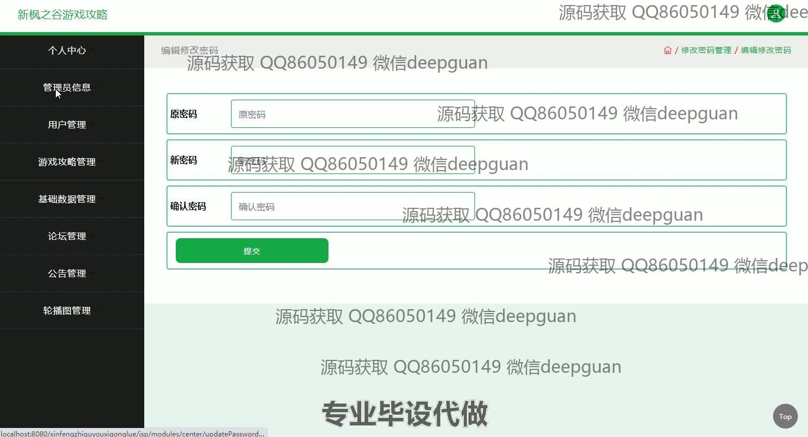
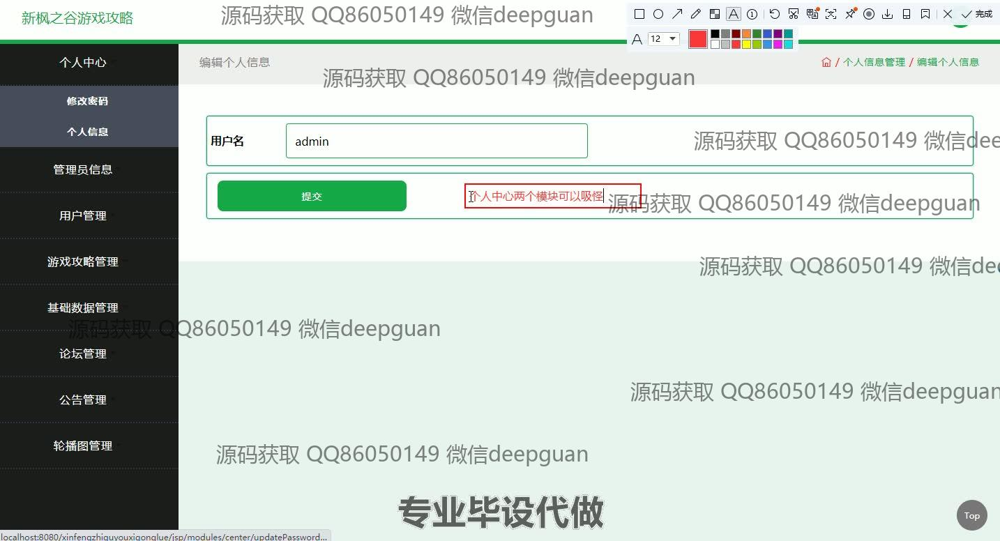
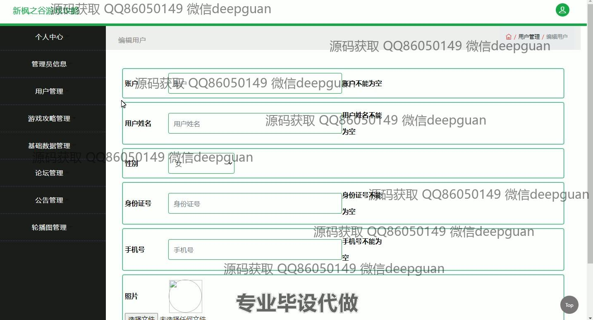
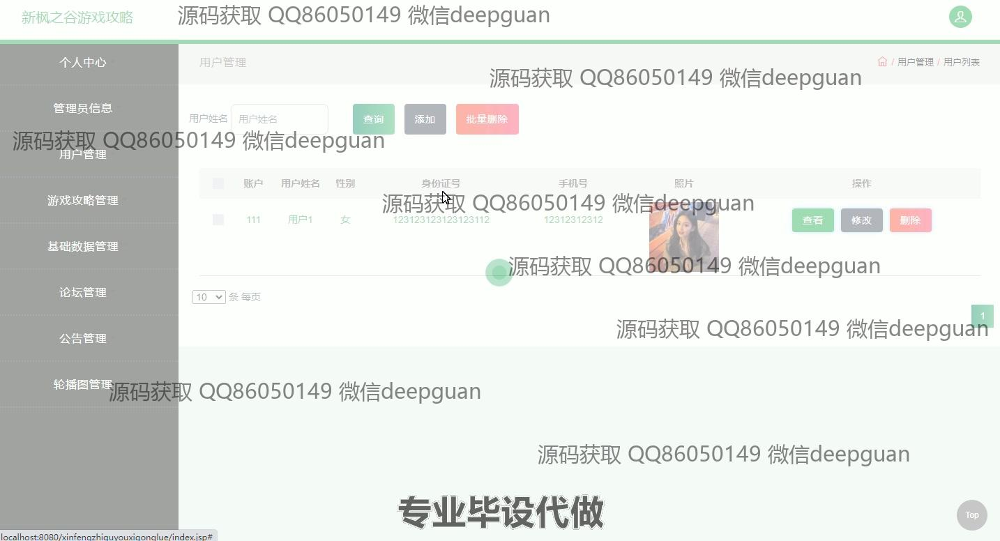

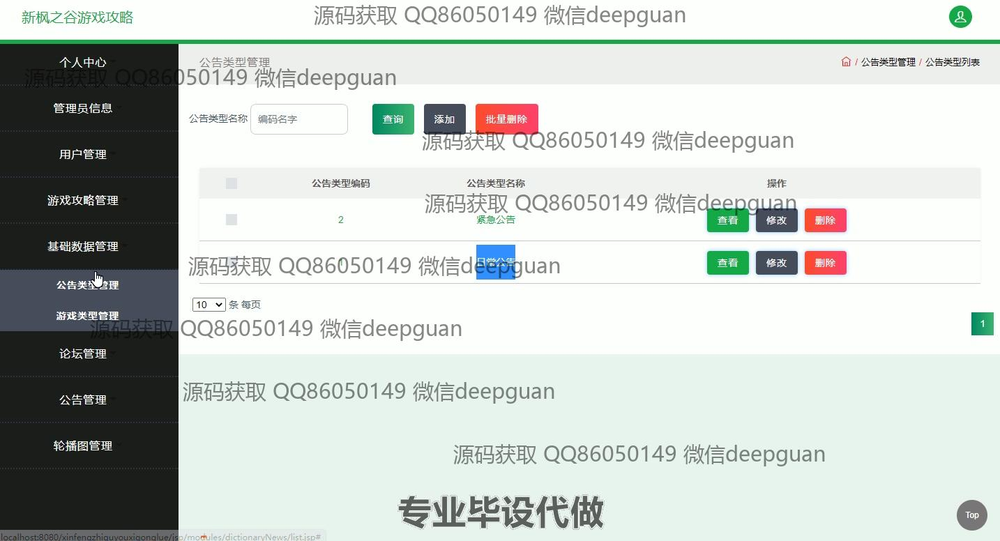
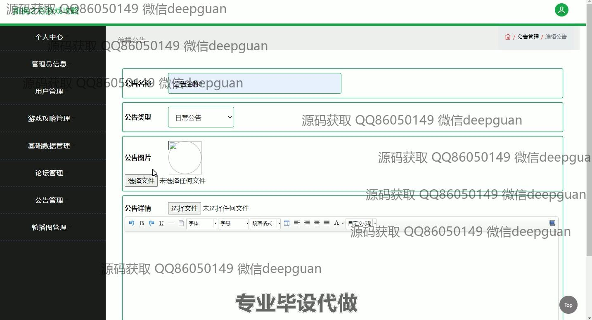
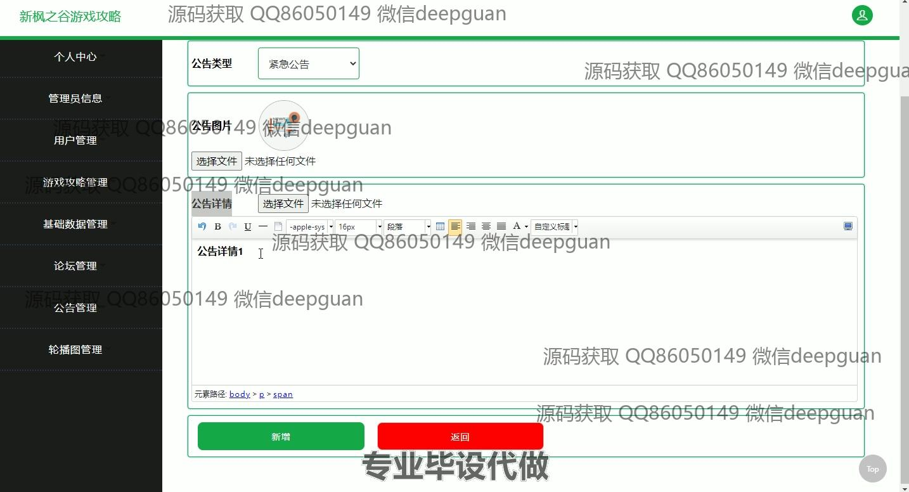
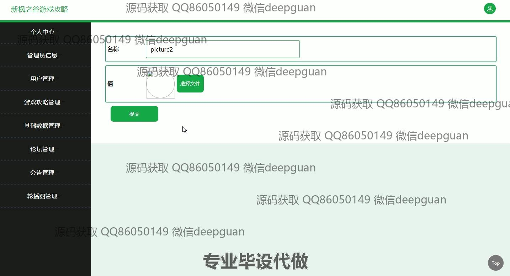

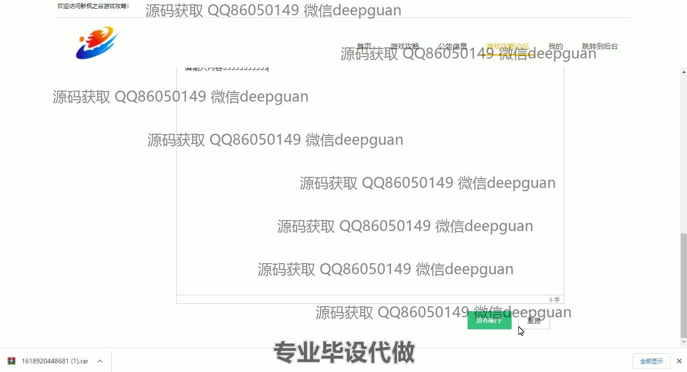
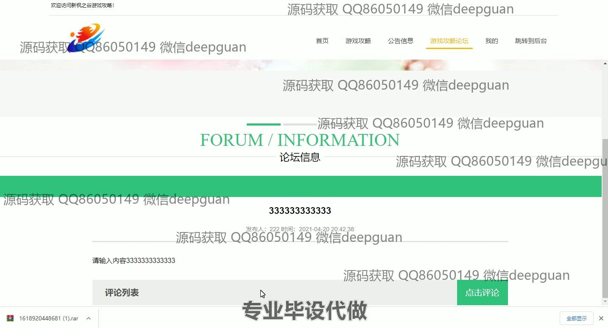

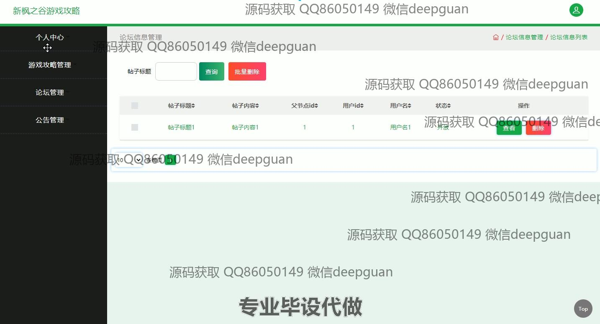
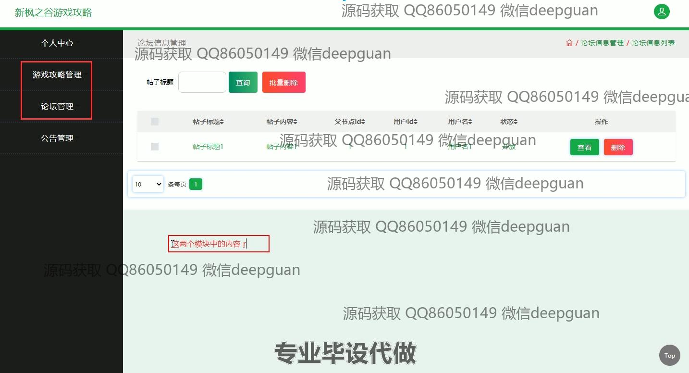
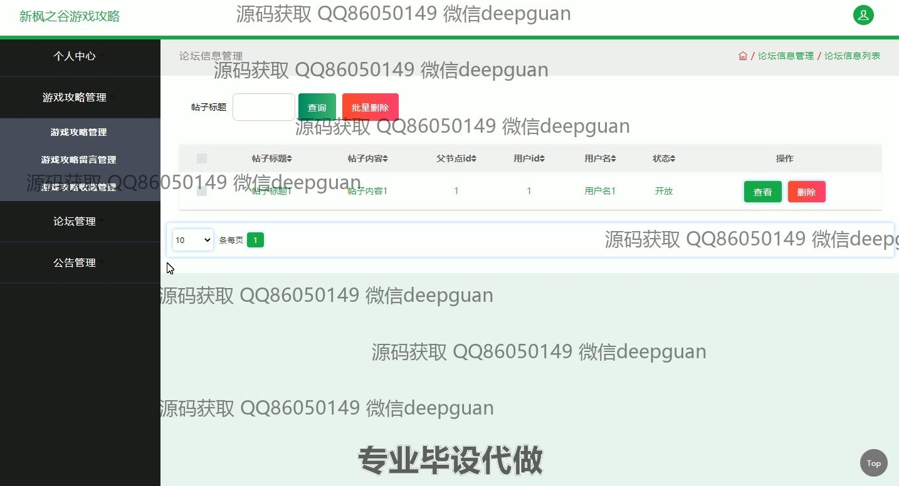

本代码来源于网络,仅供学习参考使用!

